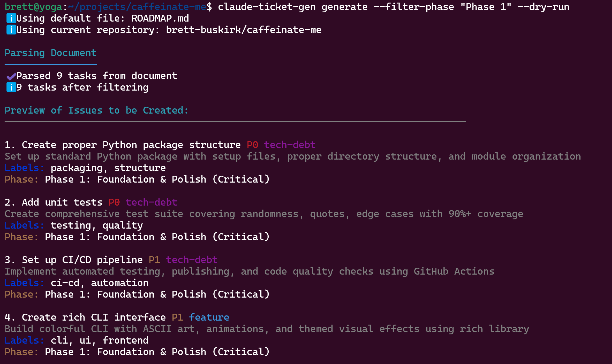
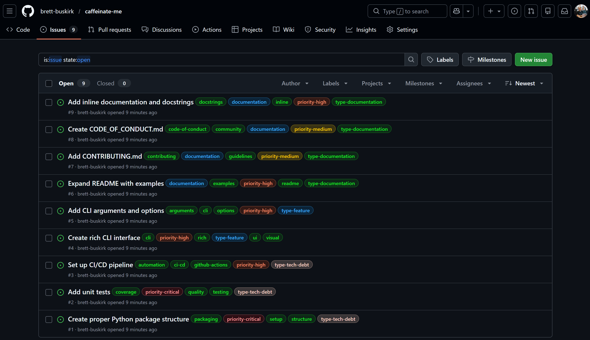
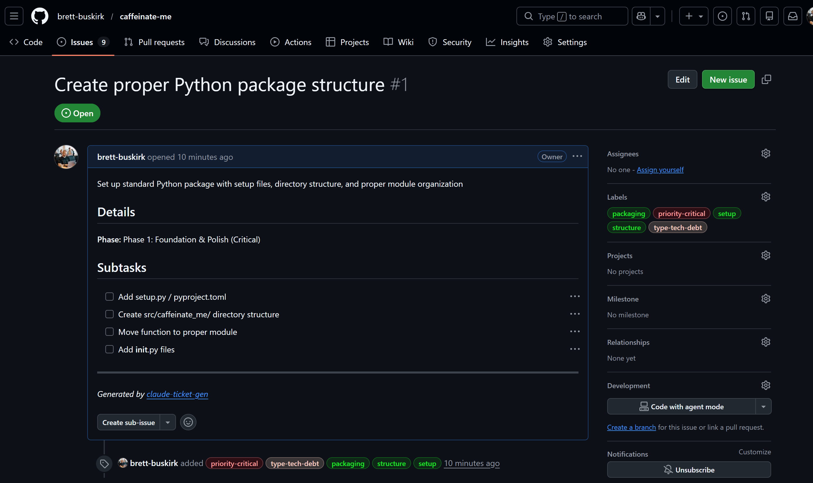
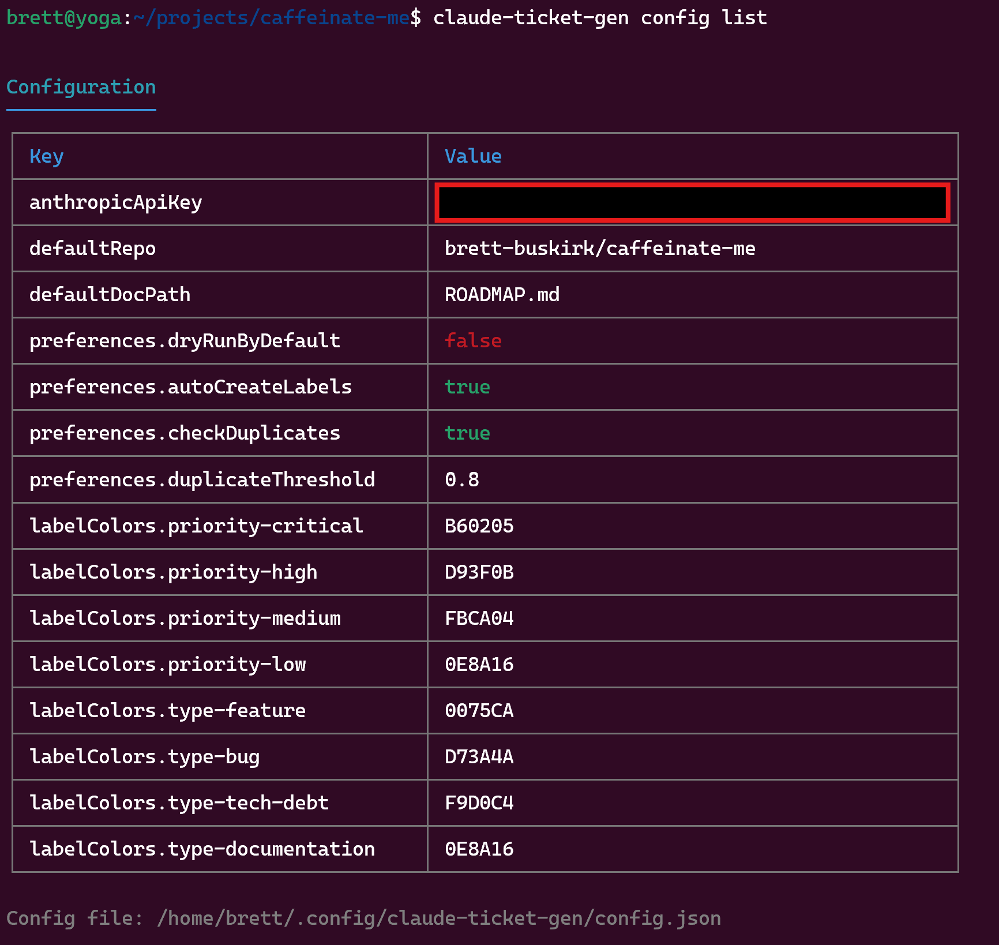
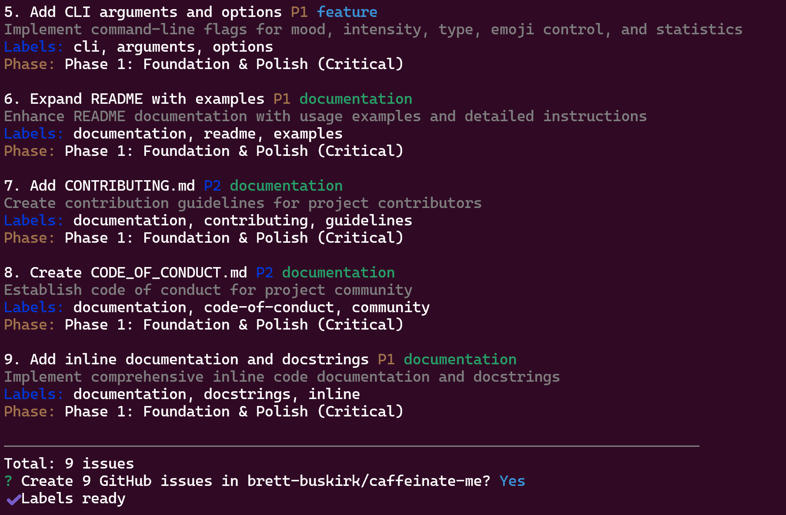

# Claude Ticket Generator

AI-powered CLI tool to parse roadmap documents and automatically generate GitHub issues using Claude AI.

## Overview

Claude Ticket Generator is a standalone npm package that uses Claude AI to intelligently parse any planning document, roadmap, or specification and automatically create structured GitHub issues. It understands various document formats and extracts tasks with their priorities, types, labels, and metadata.

## Features

- **AI-Powered Parsing**: Uses Claude AI to understand document structure and extract tasks
- **Flexible Format Support**: Works with markdown checklists, bullet points, numbered lists, and plain text
- **Smart Categorization**: Automatically detects priorities, task types, and labels
- **Duplicate Detection**: Checks for existing issues to prevent duplicates
- **Dry Run Mode**: Preview issues before creating them
- **Label Management**: Automatically creates and manages GitHub labels
- **Filtering**: Filter by phase, priority, and optional items
- **Interactive Setup**: Easy configuration wizard

## Screenshots

**CLI Preview (Dry Run)**



**Generated GitHub Issues**



**Individual Issue Detail**



## Prerequisites

- Node.js >= 18.0.0
- [GitHub CLI](https://cli.github.com/) installed and authenticated
- Anthropic API key (get one at [anthropic.com](https://www.anthropic.com))

## Installation

### Global Installation (Recommended)

```bash
npm install -g claude-gh-ticket-gen
```

### Local Installation

```bash
npm install claude-gh-ticket-gen
npx claude-ticket-gen --help
```

### From Source

```bash
git clone https://github.com/brett-buskirk/claude-ticket-gen.git
cd claude-ticket-gen
npm install
npm run build
npm link
```

## Quick Start

1. **Initialize configuration**

```bash
claude-ticket-gen init
```

This will guide you through setting up your API key and preferences.

2. **Create a roadmap document**

Create a `ROADMAP.md` file in your project (see [example](examples/ROADMAP.example.md)).

3. **Preview issues (dry run)**

```bash
claude-ticket-gen generate --dry-run
```

4. **Generate issues**

```bash
claude-ticket-gen generate
```

## Usage

### Commands

#### `generate`

Parse a document and generate GitHub issues.

```bash
claude-ticket-gen generate [file] [options]
```

**Arguments:**
- `file` - Path to roadmap/planning document (default: ROADMAP.md)

**Options:**
- `--repo <owner/repo>` - Target GitHub repository (default: current repo)
- `--dry-run` - Preview without creating issues
- `--filter-phase <name>` - Filter by phase/section
- `--min-priority <level>` - Minimum priority level (P0-P3)
- `--include-optional` - Include optional items
- `--config <path>` - Use specific config file
- `--model <id>` - Claude model to use, overriding the configured default (e.g. `claude-opus-4-8`)

**Examples:**

```bash
# Generate from default ROADMAP.md
claude-ticket-gen generate

# Preview without creating
claude-ticket-gen generate --dry-run

# Use specific file
claude-ticket-gen generate docs/PLANNING.md

# Generate for different repo
claude-ticket-gen generate --repo owner/other-repo

# Filter by priority (P0 and P1 only)
claude-ticket-gen generate --min-priority P1

# Filter by phase
claude-ticket-gen generate --filter-phase "Phase 1"

# Include optional tasks
claude-ticket-gen generate --include-optional

# Use a specific model for this run
claude-ticket-gen generate --model claude-opus-4-8
```

#### `models`

List the Claude models available to your API key. The list is fetched live from
the Anthropic API (never a hardcoded list), and the model `generate` uses by
default is marked.

```bash
claude-ticket-gen models
# or, as a convenience flag:
claude-ticket-gen --models
```

Set the default model with `config set model <id>`, or override it for a single
run with `generate --model <id>`.

#### `config`

Manage configuration settings.

```bash
# List all configuration
claude-ticket-gen config list

# Get specific value
claude-ticket-gen config get anthropicApiKey

# Set value
claude-ticket-gen config set anthropicApiKey sk-ant-...
claude-ticket-gen config set defaultRepo owner/repo
claude-ticket-gen config set model claude-opus-4-8

# Reset to defaults
claude-ticket-gen config reset
```

**Configuration List Example:**



#### `init`

Interactive setup wizard.

```bash
claude-ticket-gen init
```

## Configuration

Configuration is stored in `~/.config/claude-ticket-gen/config.json`.

### Configuration Options

```json
{
  "anthropicApiKey": "sk-ant-...",
  "defaultRepo": "owner/repo",
  "defaultDocPath": "ROADMAP.md",
  "model": "claude-haiku-4-5",
  "preferences": {
    "dryRunByDefault": false,
    "autoCreateLabels": true,
    "checkDuplicates": true,
    "duplicateThreshold": 0.8
  },
  "labelColors": {
    "priority-critical": "B60205",
    "priority-high": "D93F0B",
    "priority-medium": "FBCA04",
    "priority-low": "0E8A16",
    "type-feature": "0075CA",
    "type-bug": "D73A4A",
    "type-tech-debt": "F9D0C4",
    "type-documentation": "0E8A16",
    "optional": "E4E669"
  }
}
```

## Document Format

The tool is flexible and can parse various formats. Here's what it looks for:

### Task Formats

```markdown
- [ ] Task title (P1)
- [x] Completed task
☐ Checkbox task
✓ Completed checkbox
1. Numbered task
* Bullet point task
We need to implement feature X (plain text)
```

### Priority Indicators

```markdown
- [ ] Critical task (P0)
- [ ] High priority task (P1)
- [ ] Medium priority task (P2)
- [ ] Low priority task (P3)
- [ ] Urgent: fix this bug (keywords: urgent, critical)
- [ ] Nice to have feature (keywords: optional, nice-to-have)
```

### Task Types

The tool automatically detects task types based on context:
- `feature` - New functionality (default)
- `bug` - Bug fixes (keywords: bug, fix, issue)
- `tech-debt` - Technical debt (keywords: refactor, cleanup, tech-debt)
- `documentation` - Documentation tasks (keywords: docs, documentation)

### Example Document

```markdown
# Project Roadmap

## Phase 1: Foundation

### Authentication (Critical)
- [ ] Implement JWT authentication (P0)
- [ ] Add OAuth2 support (P1)
- [ ] Create user registration flow (P1)

### Database
- [ ] Design schema (P0)
- [ ] Set up migrations (P1)

## Phase 2: Features

### User Dashboard
- [ ] Create dashboard UI (P1)
- [ ] Add analytics widgets (P2, optional)

## Bug Fixes
- [ ] Fix login redirect (P0, bug)
- [ ] Resolve memory leak (P1, bug)
```

See [examples/ROADMAP.example.md](examples/ROADMAP.example.md) for a complete example.

## GitHub Labels

The tool automatically creates and applies these labels:

**Priority Labels:**
- `priority-critical` (P0) - Red
- `priority-high` (P1) - Orange
- `priority-medium` (P2) - Yellow
- `priority-low` (P3) - Green

**Type Labels:**
- `type-feature` - Blue
- `type-bug` - Red
- `type-tech-debt` - Pink
- `type-documentation` - Green

**Other Labels:**
- `optional` - Yellow

You can customize label colors in the configuration.

## How It Works

1. **Document Parsing**: Sends your document to Claude AI with instructions to extract structured task data
2. **Task Extraction**: Claude identifies tasks regardless of format and extracts metadata
3. **Filtering**: Applies your filter criteria (priority, phase, optional)
4. **Duplicate Detection**: Searches existing issues to prevent duplicates
5. **Label Creation**: Ensures required labels exist in the repository
6. **Issue Creation**: Creates GitHub issues via the `gh` CLI

## Duplicate Detection

The tool uses keyword-based similarity to detect duplicates:
- Searches existing open issues for similar titles
- Calculates similarity score (Jaccard similarity)
- Skips creation if similarity exceeds threshold (default: 80%)
- Configurable via `preferences.duplicateThreshold`

## Troubleshooting

### API Key Issues

```bash
# Verify API key is set
claude-ticket-gen config get anthropicApiKey

# Set or update API key
claude-ticket-gen config set anthropicApiKey sk-ant-...
```

### GitHub CLI Issues

```bash
# Check gh is installed
gh --version

# Check authentication
gh auth status

# Re-authenticate if needed
gh auth login
```

### Repository Detection

```bash
# Check current repo
gh repo view

# Specify repo explicitly
claude-ticket-gen generate --repo owner/repo

# Set default repo
claude-ticket-gen config set defaultRepo owner/repo
```

### No Tasks Found

- Verify your document contains actionable items
- Check that tasks aren't all marked as completed
- Try with `--include-optional` if tasks are marked optional
- Use `--dry-run` to see what would be created

## Examples

### Basic Workflow

```bash
# 1. Setup
claude-ticket-gen init

# 2. Create ROADMAP.md with your tasks

# 3. Preview
claude-ticket-gen generate --dry-run

# 4. Generate issues
claude-ticket-gen generate
```

### Advanced Usage

```bash
# Generate from custom file for specific repo
claude-ticket-gen generate docs/sprint-plan.md --repo owner/repo

# Only create high-priority issues
claude-ticket-gen generate --min-priority P1

# Generate for specific phase
claude-ticket-gen generate --filter-phase "Phase 1: Foundation"

# Preview including optional tasks
claude-ticket-gen generate --dry-run --include-optional
```

**Example: Creating Issues with Phase Filtering**



The tool will:
1. Parse only the specified phase from your document
2. Show a preview of tasks to be created
3. Ask for confirmation before creating issues
4. Automatically create labels if they don't exist
5. Create each issue with proper formatting and labels

## Development

```bash
# Clone repository
git clone https://github.com/brett-buskirk/claude-ticket-gen.git
cd claude-ticket-gen

# Install dependencies
npm install

# Build
npm run build

# Run locally
npm run dev -- generate --dry-run

# Link globally for testing
npm link
```

## Contributing

Contributions are welcome! Please:

1. Fork the repository
2. Create a feature branch
3. Make your changes
4. Add tests if applicable
5. Submit a pull request

## License

MIT

## Support

- Issues: [GitHub Issues](https://github.com/brett-buskirk/claude-ticket-gen/issues)
- Documentation: [README.md](README.md)

## Acknowledgments

- Uses [GitHub CLI](https://cli.github.com/)
- Powered by [@anthropic-ai/sdk](https://www.npmjs.com/package/@anthropic-ai/sdk)
